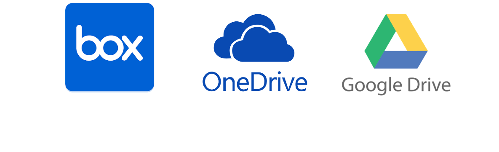

<!DOCTYPE html>
<!-- saved from url=(0023)http://localhost:50510/ -->
<html lang="en"><head><meta http-equiv="Content-Type" content="text/html; charset=UTF-8">

    <link href="./localhost_files/bootstrap.min.css" rel="stylesheet" integrity="sha384-0Mou2qXGeXK7k/Ue/a1hspEVcEP2zCpoQZw8/MPeUgISww+VmDJcy2ri9tX0a6iy" crossorigin="anonymous">
    

</head>
<body>

    <header>

        <nav class="navbar navbar-expand-md navbar-dark fixed-top" style="background-color:black">

            

                <button class="navbar-toggler" type="button" data-toggle="collapse" data-target="#navbarNavAltMarkup" aria-controls="navbarNavAltMarkup" aria-expanded="false" aria-label="Toggle navigation">
                    
                </button>
                
                

                    <ul class="navbar-nav mr-auto">

                            <li class="nav-item active">
                                <a class="nav-item nav-link" href="./index.md">Home (current)</a>
                            </li>
                            <li class="nav-item">

                                <a class="nav-item nav-link" href="./About/About.html">Help</a>
                            </li>

                    </ul>

                    
  
                   

                

            

        </nav>

    </header>

    

        

    <ol class="carousel-indicators">
        <li data-target="#myCarousel" data-slide-to="0" class=""></li>
        <li data-target="#myCarousel" data-slide-to="1" class=""></li>
        <li data-target="#myCarousel" data-slide-to="2" class=""></li>
        <li data-target="#myCarousel" data-slide-to="3" class="active"></li>
    </ol>
    

        

            
            

                

                    
<h4> Learn How Alicetrix's Cloud Migrator Software can migrate your data.</h4>
                    <a class="btn btn-lg btn-primary" href="http://localhost:50510/Home/About" role="button"> Learn More   </a>
                

            

        

        

            
            

                

                    

                        
<h5> Learn about powerful features of Software</h5>
                        <a class="btn btn-lg btn-primary" href="http://localhost:50510/Home/About" role="button"> Learn More   </a>
                    

                

            

        

        

            
            

                

                    
<h4>

                        Learn how Data Security is implemented with our hosting partners.
                    </h4>
                    <a class="btn btn-lg btn-primary" href="http://localhost:50510/Home/About" role="button"> Learn More   </a>
                

            

        

        

            
            

                

                    
                        
<h3>Learn to migrate your data at a blazing speed.</h3>
                        <a class="btn btn-lg btn-primary" href="http://localhost:50510/Home/About" role="button"> Learn More   </a>
                    
                

            

        

    

    <a class="carousel-control-prev" href="http://localhost:50510/#myCarousel" role="button" data-slide="prev">
        
        Previous
    </a>
    <a class="carousel-control-next" href="http://localhost:50510/#myCarousel" role="button" data-slide="next">
        
        Next
    </a>

<!-- Marketing messaging and featurettes
================================================== -->
<!-- Wrap the rest of the page in another container to center all the content. -->

    

        

            <h2 class="featurette-heading">Alicetrix's Cloud File Migrator  built for your specific needs </h2>
            
Our product Cloud File Migrator specializes in end to end tools and process for a seamless Cloud Migration for our customers. We believe migration of contents from Cloud providers should be fast &amp; simple for our customers! Hence we hide the complexity and try to bring a Software that takes care of most of your requirements.

        

        

            
        

    

    <!-- Three columns of text below the carousel -->
    <!-- START THE FEATURETTES -->

    

        

            
            <h2>Box</h2>
            <h5>Migrate contents from Box, Create new folders, Sync permissions, Enable/Disable Account(s)</h5>
            <h6> Current Software Offerings are: <b>BoxToOneDrive</b> Migrator </h6>
            
<a class="btn btn-secondary" href="http://localhost:50510/home/about" role="button">View details »</a>

        
<!-- /.col-lg-4 -->
        

            
            <h2>Google Drive</h2>
            <h5>Migrate contents from Google Drive, Create new folders, Sync permissions, Get forms and sheet data in Word document and excels</h5>
            <h6> Current Software Offerings are: <b>GoogleDrivetoOneDrive</b> Migrator </h6>
            
<a class="btn btn-secondary" href="http://localhost:50510/Home/About" role="button">View details »</a>

        
<!-- /.col-lg-4 -->
      
    
<!-- /.row -->

    

        

            <h2 class="featurette-heading">Offering Fast, Secure, Auto Scalable, Isloated Tenancy, Managed Migration Process  options for your data migration.</h2>
            
 We understand that customers needs a fast, reliable product for data migration, we also understand that it is customer's data, hence instead of a typical multi-tenant architecture a SaaS product provider follows we offer a simple, dedicated auto-scalable and isolated tenant for your content migration. You choose and we deploy and let you manage your migration by powerful features built in the tool. We also have deployed a process that helps you follow step-by-step process of cloud deployment. 

        

        

            
        

    

   

        

        <footer>
            

                

                    <h5>© 2019 - Alicetrix LLC</h5>
                    
                

                

                    <h5>
                        Contact us at our support email with your queries
                        at: <a href="mailto:contacts@alicetrix.com?subject=Support%20Needed">support@alicetrix.com</a> 
                    </h5>

                    

                        

                            <a href="http://localhost:50510/#" data-toggle="collapse" data-target="#collapseOne" aria-expanded="true" aria-controls="collapseOne">
                                Assumptions and Liability Disclaimers
                            </a>

                        

                        

                            

                                

                                    *Active tenants for migration should be deprovisioned to stop charges. Microsoft Azure provides options to provision and deprovision tenants on a click of a button from cloud platforms.
                                

                                

                                    ²Any Speed advertised is not promised but based on our results in labs and active customers.
                                

                                

                                    *Under consideration for Patent
                                

                                

                                    ³In some cases Bandwidth charges may apply. Please visit your current bandwidth requirements with your cloud provider for both source and destination tenant as well as Hosting environment
                                

                                

                                    Safe Harbor
                                    SOFTWARE HAS BEEN TESTED AND VALIDATED IN CONFINES OF GENERIC REQUIREMENTS. YOU ARE EXPECTED TO TEST AND ENSURE SOFTWARE IS ABLE TO MEET YOUR REQUIREMENTS.
                                    THE SOFTWARE IS PROVIDED "AS IS", WITHOUT WARRANTY OF ANY KIND, EXPRESS OR IMPLIED, INCLUDING BUT NOT LIMITED TO THE WARRANTIES OF MERCHANTABILITY, FITNESS FOR A PARTICULAR PURPOSE AND NONINFRINGEMENT. IN NO EVENT SHALL THE AUTHORS OR COPYRIGHT HOLDERS BE LIABLE FOR ANY CLAIM, DAMAGES OR OTHER LIABILITY, WHETHER IN AN ACTION OF CONTRACT, OR OTHERWISE, ARISING FROM, OUT OF OR IN CONNECTION WITH THE SOFTWARE OR THE USE OR OTHER DEALINGS IN THE SOFTWARE.
                                    Please direct all your queries  on know-how of application to company support email address.NO SLA Applies.
                                

                            

                        

                    

                    &nbsp;
                    <h6>
                        
                        ©Copyrighted
                    </h6>

                

             
            

                    
                       
                     
            </footer>

        
  
    
    
    
    

    

<!-- Visual Studio Browser Link -->

<!-- End Browser Link -->

</body></html>
