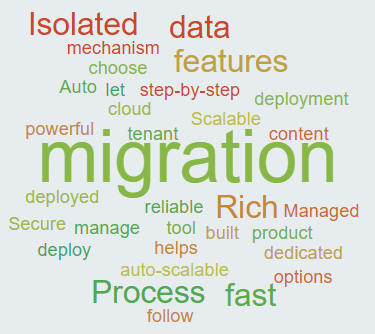

    

    

        &nbsp;
    

   
   
    

        

    <ol class="carousel-indicators">
        <li data-target="#myCarousel" data-slide-to="0" class=""></li>
        <li data-target="#myCarousel" data-slide-to="1" class=""></li>
        <li data-target="#myCarousel" data-slide-to="2" class=""></li>
        <li data-target="#myCarousel" data-slide-to="3" class="active"></li>
    </ol>
    

        

            
            

                

                    
<h4> Learn How Alicetrix's Cloud Migrator Software can migrate your data.</h4>
                    <a class="btn btn-lg btn-primary" href="./about" role="button"> Learn More   </a>
                

            

        

        

            
            

                

                    

                        
<h5> Learn about powerful features of Software</h5>
                        <a class="btn btn-lg btn-primary" href="./about" role="button"> Learn More   </a>
                    

                

            

        

        

            
            

                

                    

                    <h4>
                        Learn how Data Security is implemented with our hosting partners.
                    </h4>
                    <a class="btn btn-lg btn-primary" href="./about" role="button"> Learn More   </a>
                

            

        

        

            
            

                

                    
                        
<h3>Learn to migrate your data at a blazing speed.</h3>
                        <a class="btn btn-lg btn-primary" href="./about" role="button"> Learn More   </a>
                    
                

            

        

    

    <a class="carousel-control-prev" href="./#myCarousel" role="button" data-slide="prev">
        
        Previous
    </a>
    <a class="carousel-control-next" href="./#myCarousel" role="button" data-slide="next">
        
        Next
    </a>

<!-- Marketing messaging and featurettes
================================================== -->
<!-- Wrap the rest of the page in another container to center all the content. -->

    

            

            <h3 class="featurette-heading">Alicetrix's Enterprise Cloud File Migrator  built for your specific needs </h3>
            
 Our Alicetrix's Enterprise Cloud File Migrator specializes in cutting edge tools and processes for a seamless cloud migration for our clients. We believe that the migration of files should be fast and simple. So, we try not to make it so complex while bringing a software that can assist you with your transfer.
            

        

    

        

            <video width="300" controls autoplay>
            <source src="about/Help/video/Alicetrix Video 1.mp4" type="video/mp4">
            Your browser does not support the video tag.
            </video>
        
   
    
        

    <!-- Three columns of text below the carousel -->
    <!-- START THE FEATURETTES -->
    

        

            
            <h2>Box</h2>
            <h5>Migrate contents from Box, Create new folders, Migrate permissions, Get file content reports from Box</h5>
            <h6> Current Software Offerings are: <b>Box To OneDrive and SharePoint Online</b> Migrator </h6>
            
<a class="btn btn-secondary" href="./about" role="button">View details »</a>

        
<!-- /.col-lg-4 -->
        

            
            <h2>Google Drive</h2>
            <h5>Migrate contents from Google Drive, Create new folders, Migrate permissions, Get file content reports from Google Drive, and convert your Google forms, sheets, and docs into Microsoft Office documents</h5>
            <h6> Current Software Offerings are: <b>Google Drive to OneDrive and SharePoint Online</b> Migrator </h6>
            
<a class="btn btn-secondary" href="./about" role="button">View details »</a>

        
<!-- /.col-lg-4 -->      
    
<!-- /.row -->
    

        

            <h2 class="featurette-heading">Offering Fast, Secure, Auto Scalable, Isloated Tenancy, Managed Migration Process  options for your file migration.</h2>
            
 We understand that customers need a fast, reliable product for file migration. We also understand that it is customer's data, so instead of a typical shared-tenant architecture a SaaS company usually provides, we offer a simple, dedicated, secure, scalable and isolated server utlizing powerful capabilities of Windows Server for your content migration. You choose cloud server sizes and we have enabled DevOps in Cloud to automatically deploy and let you manage your migration. Additionally, all security related configurations to access multi-cloud environment are your's in the server. Hence to a provider like Google or Box, it is not a third-party or partner migrating the contents, that ensures higher service levels. We have also enabled a process that includes remediation steps that helps you follow step-by-step process of migration. A faster reupload option is available that ensures business is not disrupted when you migrate your data. You stay in full control of your migration thanks to our easy to navigate interactive user interface. You won't even have to worry about messing something up in the setup thanks to our clear and easy to read instructions. And if anything goes wrong, report the issue to us and our expert team will try their very best to assist as soon as possible. 

        

        

            
        

    

